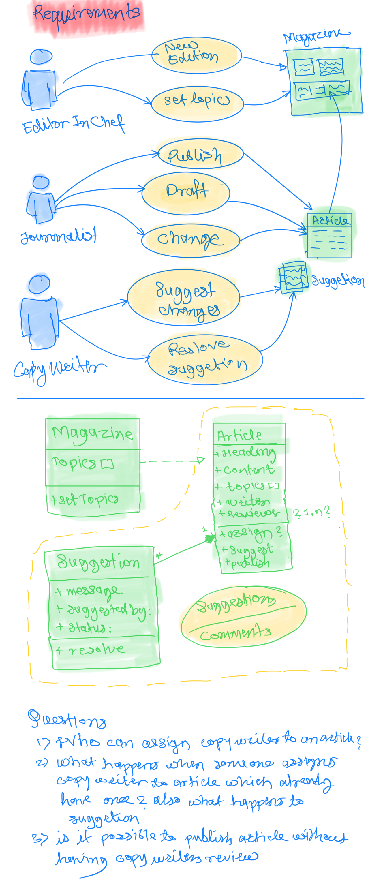

# CQRS + ES + DDD core

### Requirements and my interpretation

### Setup options
Clone repo and use your favorite editor
1. Rider + [.NET Core 3.1](https://dotnet.microsoft.com/download)
1. [VSCode](https://code.visualstudio.com/)
    - VS Code > Terminal > Run Task > test
    -VS Code > Terminal > New Terminal and then `dotnet test -v=n`

### Assumptions:
1. Editor will assign article to copy writers to review
1. Events won't not have aggregateID within themselves; but it is with envelope.
    - Imagine events are personal letter and aggregateId as communication address and other details on envelope.
1. EventStore is implemented in memory and each Aggregate will share same EventStore

### Things completed
- [ ] As an editor in chief, I add a list of topics for the new edition of a magazine.
- [x] As a journalist, I submit a draft article for publishing to a given topic
- [X] As a copywriter, I suggest changes to the draft article I'm assigned to
- [X] As a journalist, I respond to suggestions by making the suggested changes
- [X] As a copywriter, I resolve suggestions that the journalist applied
- [X] As a journalist, I can publish the article after all suggestions are resolved

### Pending Items:

- [ ] Replace string to `NonEmpty<String>` type from domain (article, message, commands..etc)
- [ ] Integrate with in memory store..
- [ ] move out Event Producer from Article file.